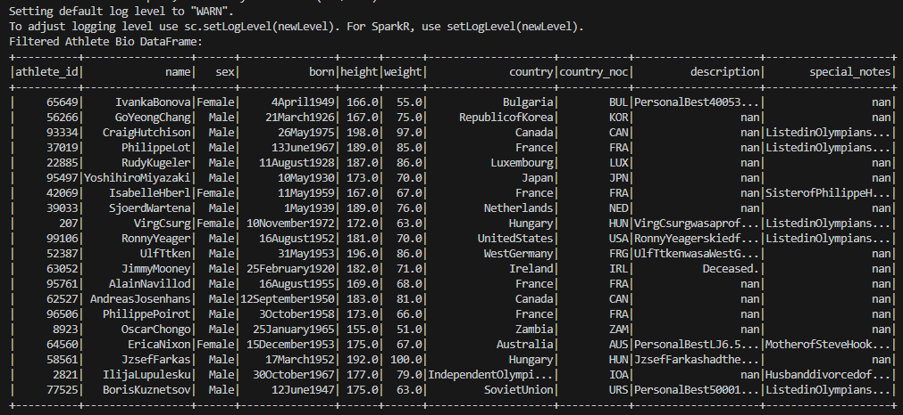
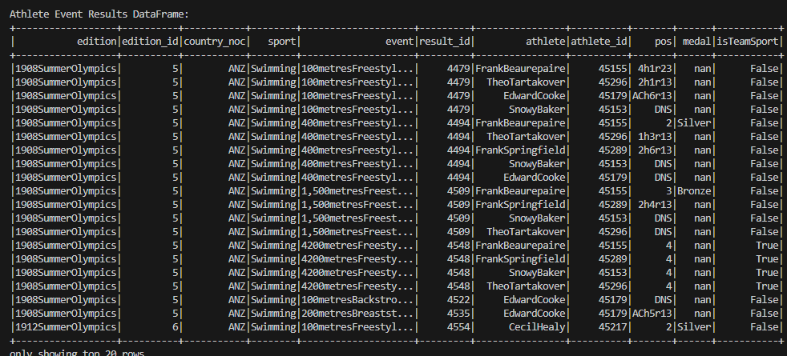
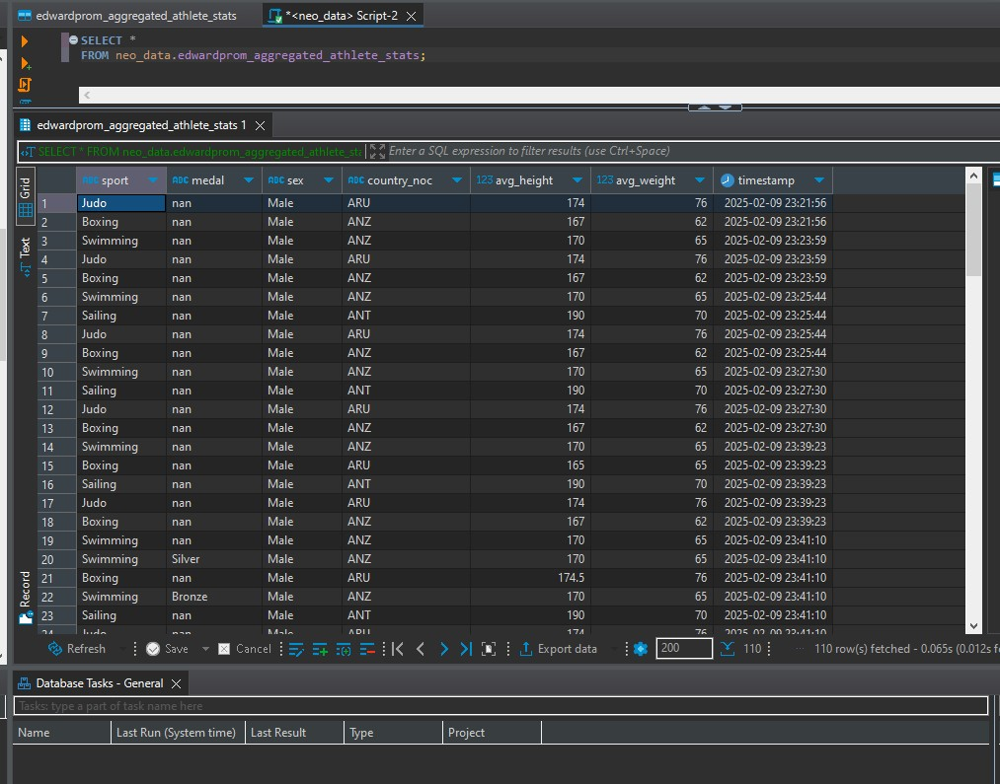
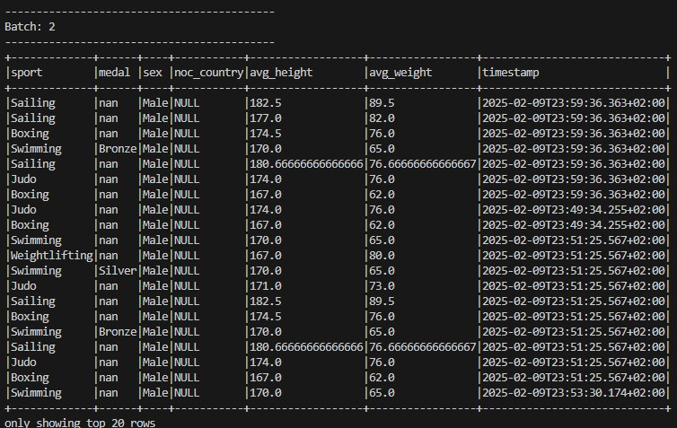
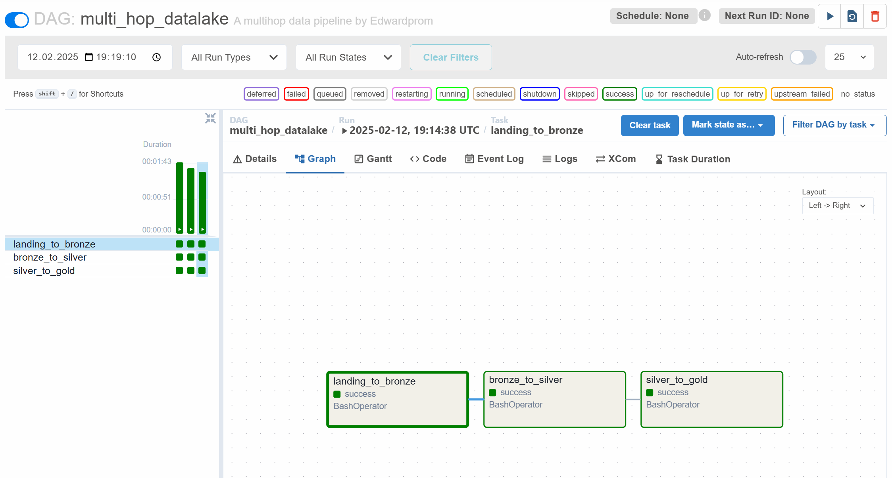
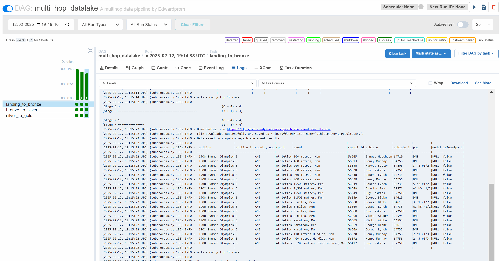
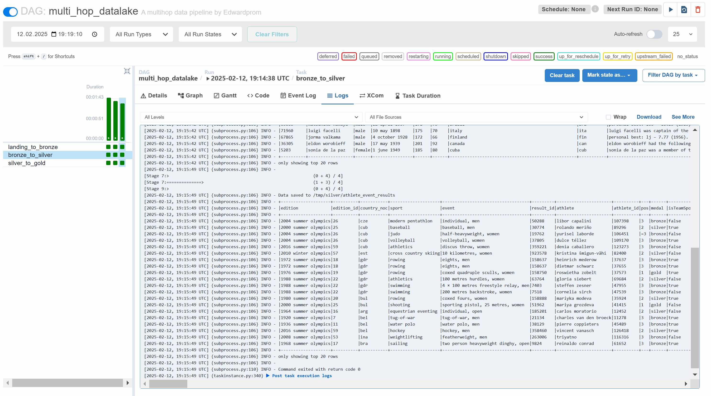
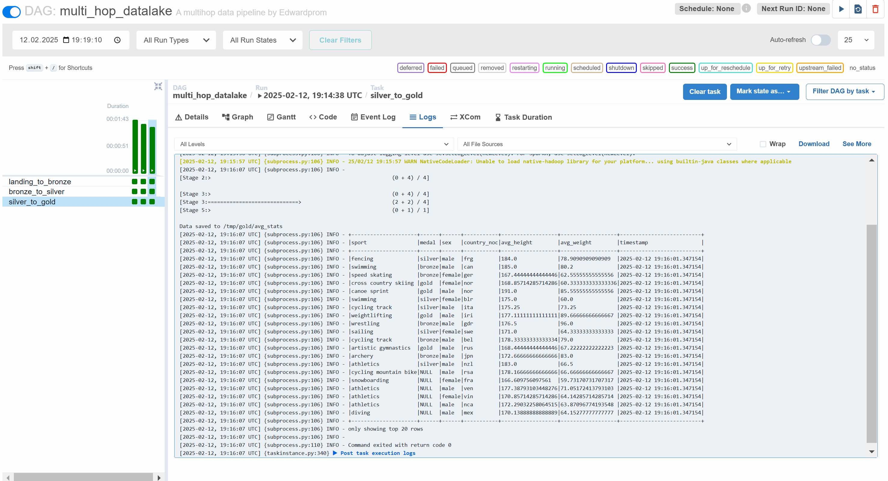

Проєкт реалізує обробку даних спортсменів за допомогою **Apache Kafka, Spark і Airflow**. Він складається з двох частин:

## Частина 1: Стрімінговий пайплайн

### Скриншоти:
✅ Відфільтровані дані спортсменів  
  
✅ Результати змагань  
  
✅ Агреговані статистичні дані  
  
✅ Kafka-вихідні дані  
  

## Частина 2: Batch Data Lake

### Скриншоти:
✅ DAG виконання  
  
✅ Логи пайплайну  
  
✅ Фінальні Gold-рівня дані  
  
✅ Загальний процес  
 